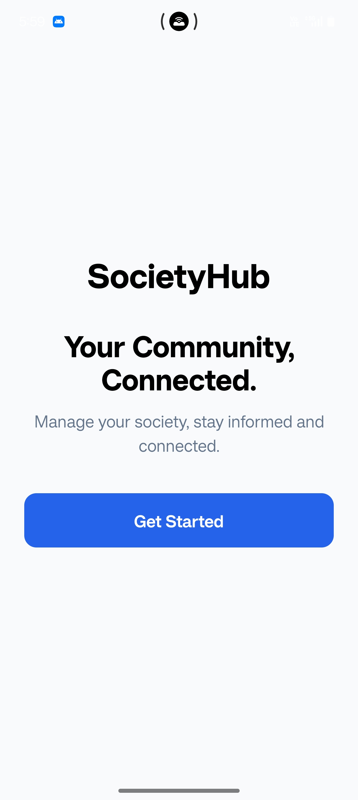
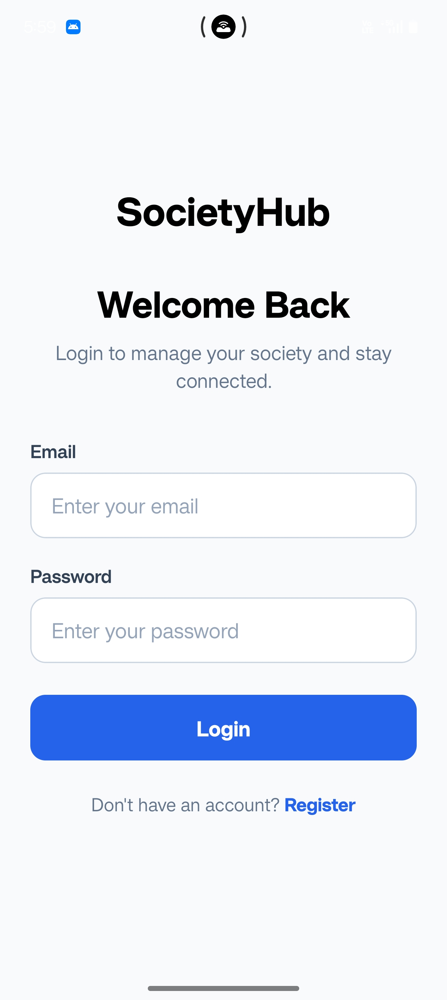
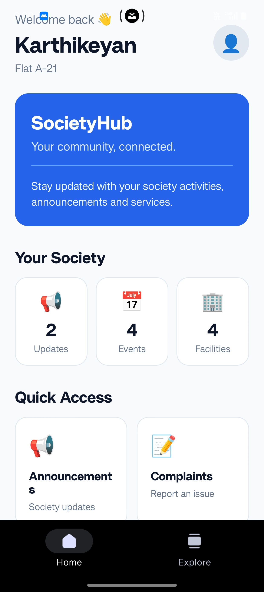
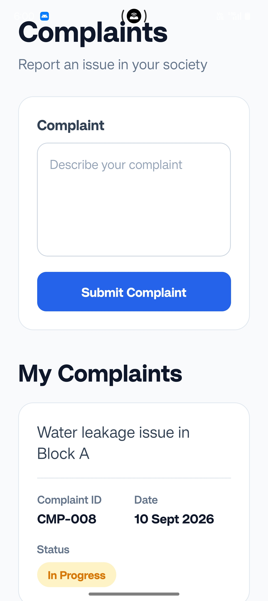
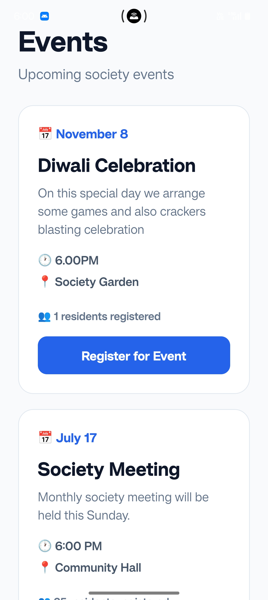
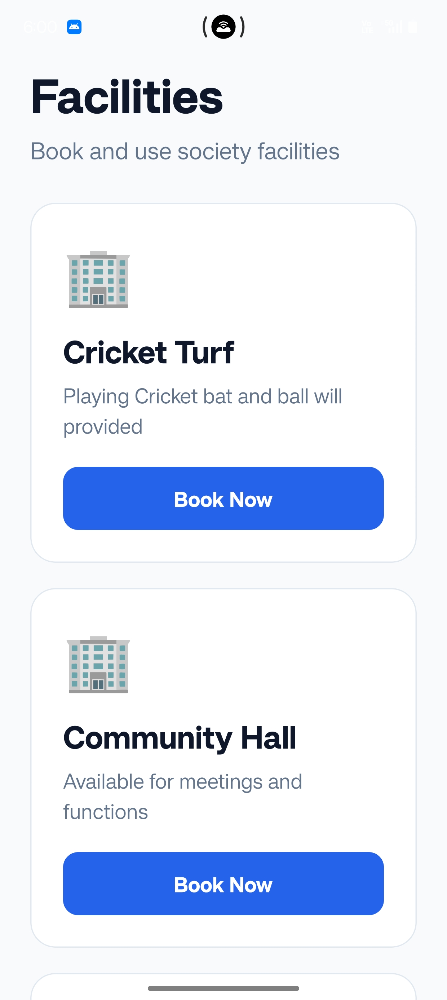
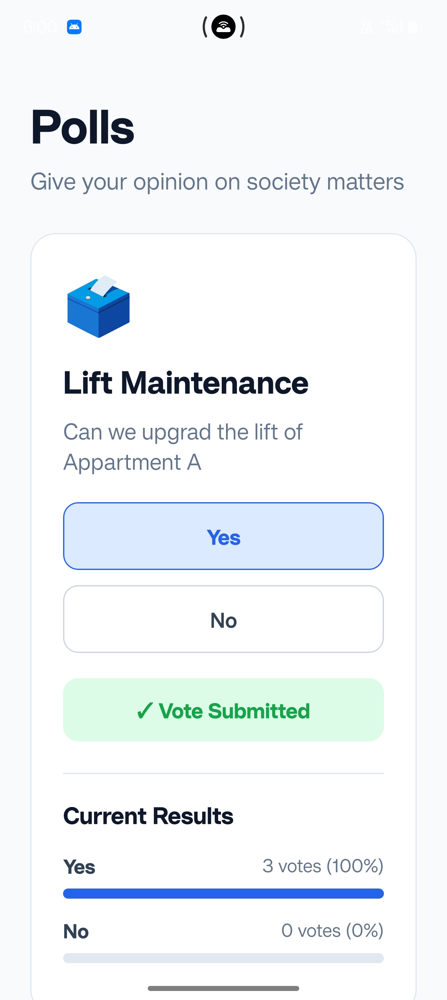
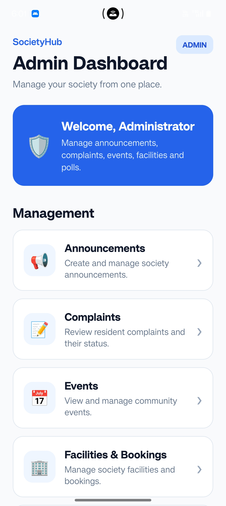
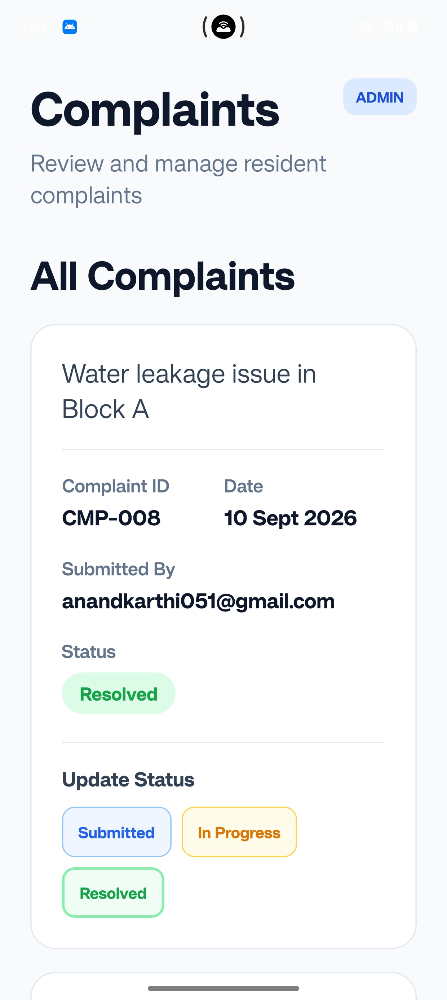

# SocietyHub 🏢

## Project Overview

SocietyHub is a Society / Community Management mobile application developed using React Native, Expo, and TypeScript.

The application is designed to simplify communication and common activities within a residential society. Residents can view announcements, submit complaints, participate in events and polls, book society facilities, and manage their profiles.

The application provides separate functionality for:

- Residents
- Administrators

Administrators can manage society announcements, complaints, events, facilities, bookings, and polls through an admin dashboard.

The project is developed and tested as an Android mobile application.

---

## Platform

- **Target Platform:** Android Mobile
- **Framework:** React Native
- **Development Environment:** Expo
- **Programming Language:** TypeScript

---

# Features Implemented

## Resident Features

### Registration

Residents can create an account by providing:

- Full Name
- Email
- Flat Number
- Password

Basic validation is provided for registration details.

### Login

Registered residents can log in using their email and password.

The application also provides a separate administrator login.

### Resident Dashboard

The resident dashboard provides:

- Personalized welcome message
- Resident information
- Society updates
- Quick access to application features
- Dynamic counts for announcements, events, and facilities

### Announcements

Residents can view important society announcements.

Administrators can:

- Create announcements
- View announcements
- Delete announcements
- Set announcement priority

### Complaint Management

Residents can submit complaints related to society services or facilities.

Residents can:

- Submit complaints
- View their complaints
- Track complaint status

Administrators can:

- View resident complaints
- View submitted-by information
- Update complaint status

Complaint statuses include:

- Submitted
- In Progress
- Resolved

### Events

Residents can:

- View upcoming society events
- View event details
- Register for events

Administrators can:

- Create events
- View events
- Delete events

### Facility Booking

Residents can:

- View available society facilities
- Select a date
- Select a time
- Book a facility

The application prevents duplicate bookings for the same facility, date, and time.

### Polls

Residents can:

- View active polls
- Select an option
- Submit their vote
- View poll results

The application prevents a resident from voting multiple times in the same poll.

Administrators can:

- Create polls
- Manage polls
- View poll results

### Profile Management

Residents can:

- View profile information
- Edit profile information
- Save updated profile details

### Logout

Users can end their current application session using the logout option.

---

# Administrator Features

The administrator has access to a dedicated dashboard.

Admin features include:

- Admin dashboard
- Announcement management
- Complaint management
- Event management
- Facility management
- Facility booking management
- Poll management
- Poll result viewing
- Role-based access protection
- Logout

Administrators can manage society information from a centralized dashboard.

---

# Technology Stack

| Technology | Purpose |
|------------|---------|
| React Native | Mobile application development |
| Expo | Development, running and Android testing |
| TypeScript | Type-safe application development |
| Expo Router | Navigation and routing |
| AsyncStorage | Local persistent data storage |
| React Hooks | State and lifecycle management |

---

# Architecture

SocietyHub follows a modular screen-based application architecture.

The application is organized into:

- Authentication screens
- Resident screens
- Administrator screens
- Reusable components
- Local storage utilities

React state and hooks are used for screen-level state management.

AsyncStorage acts as the local persistence layer for application data.

## High-Level Architecture

```text
                         SocietyHub
                             │
                             ▼
                  ┌────────────────────┐
                  │  Authentication    │
                  │  Login / Register  │
                  └─────────┬──────────┘
                            │
                            ▼
                  ┌────────────────────┐
                  │   Role Management  │
                  └─────────┬──────────┘
                            │
              ┌─────────────┴─────────────┐
              │                           │
              ▼                           ▼
       ┌──────────────┐           ┌──────────────┐
       │   Resident   │           │     Admin    │
       │    Screens   │           │   Dashboard  │
       └──────┬───────┘           └──────┬───────┘
              │                          │
              └────────────┬─────────────┘
                           │
                           ▼
                ┌──────────────────────┐
                │ Application Features │
                │                      │
                │ Announcements        │
                │ Complaints           │
                │ Events               │
                │ Facilities / Booking │
                │ Polls                │
                │ Profile              │
                └──────────┬───────────┘
                           │
                           ▼
                ┌──────────────────────┐
                │    Storage Layer     │
                │    AsyncStorage      │
                └──────────────────────┘
```

---

# Libraries and Frameworks

## React Native

Used to build the mobile application interface and application screens.

## Expo

Used for application development, running the project, and testing the application on Android devices.

## Expo Router

Used for navigation between authentication, resident, and administrator screens.

## AsyncStorage

Used for persistent local data storage.

## React Hooks

React Hooks such as:

- `useState`
- `useEffect`
- `useCallback`
- `useFocusEffect`

are used for state management, loading data, and refreshing screens when required.

---

# Project Structure

```text
SocietyHub
│
├── assets
│
├── src
│   │
│   ├── app
│   │   │
│   │   ├── (tabs)
│   │   │   ├── _layout.tsx
│   │   │   ├── home.tsx
│   │   │   └── explore.tsx
│   │   │
│   │   ├── _layout.tsx
│   │   ├── welcome.tsx
│   │   ├── login.tsx
│   │   ├── register.tsx
│   │   ├── profile.tsx
│   │   ├── edit-profile.tsx
│   │   ├── announcement.tsx
│   │   ├── complaints.tsx
│   │   ├── events.tsx
│   │   ├── booking.tsx
│   │   ├── polls.tsx
│   │   │
│   │   ├── admin.tsx
│   │   ├── admin-announcement.tsx
│   │   ├── admin-events.tsx
│   │   ├── admin-facilities.tsx
│   │   └── admin-poll.tsx
│   │
│   └── components
│
├── package.json
├── tsconfig.json
└── README.md
```

---

# Application Flow

```text
                         START
                           │
                           ▼
                    Welcome Screen
                           │
                  ┌────────┴────────┐
                  │                 │
                  ▼                 ▼
                Login            Register
                  │                 │
                  │                 ▼
                  │          Create Account
                  │                 │
                  └────────┬────────┘
                           ▼
                    Authentication
                           │
                           ▼
                    Check User Role
                           │
                 ┌─────────┴─────────┐
                 │                   │
                 ▼                   ▼
             Resident              Admin
                 │                   │
                 ▼                   ▼
        Resident Dashboard    Admin Dashboard
                 │                   │
       ┌─────────┼─────────┐   ┌─────┼─────────┐
       │         │         │   │     │         │
       ▼         ▼         ▼   ▼     ▼         ▼
 Announcements Complaints Events  Announcements
 Bookings      Polls      Profile Complaints
                                   Events
                                   Facilities
                                   Polls
                 │                   │
                 └─────────┬─────────┘
                           ▼
                     AsyncStorage
```

---

# Data Storage

SocietyHub uses **AsyncStorage** for local persistent data storage.

A reusable storage utility is used to save, retrieve, and remove application data.

The application stores information such as:

- User account information
- Login session
- User role
- Profile information
- Announcements
- Events
- Facilities
- Complaints
- Polls
- Event registrations
- Facility bookings
- Poll voting records

The application uses user-specific storage for resident-related data such as event registrations, facility bookings, and poll voting records.

---

# Authentication and Authorization

SocietyHub implements local authentication for the technical assessment.

The application supports two roles:

- Resident
- Admin

After login, the user's role is checked to determine which screens can be accessed.

Role-based protection prevents resident users from accessing administrator screens.

## Demo Administrator Account

```text
Email: admin@societyhub.com
Password: admin123
```

> The authentication system is implemented locally for demonstration and assessment purposes. A production application should use secure backend authentication and password protection.

---

# Error Handling and Validation

The application provides basic validation and error handling for common situations.

Examples include:

- Empty registration fields
- Invalid email format
- Invalid login credentials
- Incorrect administrator credentials
- Unauthorized admin access
- Duplicate facility bookings
- Duplicate poll voting
- Missing application data
- Storage errors

User-friendly alerts and messages are displayed when an operation cannot be completed.

---

# Loading and Empty States

The application handles cases where data is unavailable or screens require data loading.

Examples include:

- No announcements available
- No complaints available
- No events available
- No facilities available
- No bookings available
- No polls available

This helps prevent screens from appearing broken when there is no data.

---

# User Interface and UX

SocietyHub uses a simple and mobile-friendly interface.

The UI includes:

- Card-based layouts
- Clear section headings
- Consistent spacing
- Action buttons
- Status badges
- Admin role badges
- Form inputs
- Alerts for important actions
- Empty-state messages
- Responsive layouts

The design focuses on making common society management operations easy to access.

---

# Screenshots

Screenshots of the main application screens are included below.

## Welcome Screen


## Login Screen


## Resident Dashboard


## Announcements


## Complaints


## Events


## Facility Booking


## Polls


## Admin Dashboard


## Admin Complaints Management



---

# Setup Instructions

## Prerequisites

Install the following before running the application:

- Node.js
- npm
- Expo
- Expo Go

An Android device or Android emulator is required for Android testing.

## Clone the Repository

```bash
git clone https://github.com/karthikeyan6676-hash/SocietyHub.git
```

## Navigate to the Project

```bash
cd SocietyHub
```

## Install Dependencies

```bash
npm install
```

## Start the Application

```bash
npx expo start
```

## Run on Android

1. Install Expo Go on the Android device.
2. Connect the Android device and development computer to the same network.
3. Start the Expo development server.
4. Scan the QR code using Expo Go.
5. The SocietyHub application will open on the Android device.

---

# Testing

The application was manually tested on an Android device using Expo Go.

The following major application flows were tested:

- Resident registration
- Resident login
- Invalid login
- Administrator login
- Role-based access protection
- Announcement creation and viewing
- Complaint submission
- Complaint status updates
- Event creation
- Event registration
- Facility booking
- Duplicate facility booking prevention
- Poll creation
- Poll voting
- Duplicate voting prevention
- Profile editing
- Logout
- Navigation between screens
- Data persistence using AsyncStorage
- Admin-to-resident data updates

---

# Known Limitations

The current version has the following limitations:

1. Application data is stored locally using AsyncStorage.
2. Data is not synchronized between multiple devices.
3. A cloud backend or real-time database is not currently implemented.
4. Authentication is implemented locally for the technical assessment.
5. Password storage is not suitable for production-level security.
6. Push notifications are not currently implemented.
7. The application is primarily focused on the core society management requirements.

---

# Future Improvements

The application can be extended with:

- Firebase or REST API backend
- Secure authentication
- Password hashing
- Cloud database
- Real-time data synchronization
- Push notifications
- Visitor management
- Maintenance payment system
- Emergency contact management
- Resident directory
- Community chat
- Document sharing
- Admin analytics dashboard
- Automated event and announcement notifications
- Multi-device synchronization

---

# Application Design Principles

The project follows the following principles:

- Modular screen organization
- Separation of authentication and feature screens
- Reusable storage utilities
- Role-based access control
- User-specific data handling
- Component-based UI development
- TypeScript type safety
- Simple and maintainable code structure

---

# Conclusion

SocietyHub provides a simple digital platform for managing common residential society activities.

The project demonstrates practical implementation of:

- React Native mobile development
- TypeScript
- Expo
- Expo Router navigation
- Role-based access control
- Local persistent storage
- Resident and administrator workflows
- Form validation
- State management
- Error handling
- Modular application structure

The project was developed as a technical assessment project with Android Mobile as the target platform.

---

# Developer

**Karthikeyan**

**Project:** SocietyHub – Society / Community Management Application

**Platform:** Android Mobile

**Technology:** React Native + Expo + TypeScript